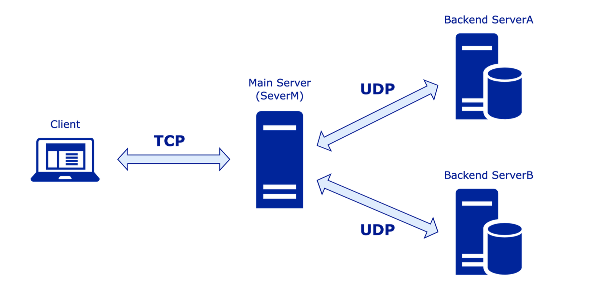

# Socket-Programming-Computer-Networks

## Developed a **meeting scheduling system** using **UNIX socket programming** with TCP and UDP communication.

---

## 🔹 Tech Stack

**Programming Language:** C++  
**Networking:** UNIX Sockets, TCP, UDP  
**Development Environment:** Ubuntu 22.04 

**Libraries & Tools:**
- **Beej’s Guide to Network Programming** - Socket programming reference
- **POSIX Sockets** - Implementing client-server communication
- **Makefile** - For compiling and running executables

---

## 🔹 System Overview



This project implements a **meeting scheduler** that:
- Enables users to **schedule a meeting with a group of people**.
- Uses **a client, main server, and two backend servers**.
- Communicates between **client & main server using TCP** and **main server & backend servers using UDP**.
- Finds **common available meeting slots** for multiple users.

The system consists of **four main components**:
1. **Client (client.cpp)** - Takes user input (names) and requests available time slots.
2. **Main Server (serverM.cpp)** - Manages user requests and forwards them to backend servers.
3. **Backend Server A (serverA.cpp)** - Stores availability data for a subset of users.
4. **Backend Server B (serverB.cpp)** - Stores availability data for another subset of users.

---

## 🔹 Workflow & Communication

1. **Boot-up Phase**
   - The **Main Server (ServerM)** starts and listens for incoming connections.
   - **Backend Servers (ServerA & ServerB)** load user availability data from input files (`a.txt`, `b.txt`).
   - **Backend Servers** send the list of stored users to **Main Server** via **UDP**.

2. **Request & Forwarding Phase**
   - The **Client** sends a list of participants to the **Main Server** via **TCP**.
   - The **Main Server** determines which **Backend Server** stores the required users' availability.
   - The **Main Server** forwards the request to the correct **Backend Server** via **UDP**.

3. **Scheduling Phase**
   - Each **Backend Server** finds the common available time slots for the requested users.
   - The **Backend Server** returns the result to the **Main Server**.

4. **Reply & Final Intersection Phase**
   - The **Main Server** aggregates availability from both **Backend Servers**.
   - The final list of available meeting times is sent back to the **Client** via **TCP**.

---

## 🔹 Code Files & Their Purpose

### 1. **serverM.cpp** (Main Server)
- Handles **client requests** and forwards them to the correct backend servers.
- Creates a **TCP socket** to communicate with the **Client**.
- Creates a **UDP socket** to communicate with **Backend Servers**.
- Determines if the user belongs to `serverA` or `serverB` based on input files.
- **Aggregates** the final meeting time slots from both backend servers.

### 2. **serverA.cpp** (Backend Server A)
- Creates a **UDP socket** to communicate with the **Main Server**.
- Reads **user availability data** from `a.txt` and stores it in a **map data structure**.
- Finds **common available time slots** for requested users.
- Sends the result back to **Main Server**.

### 3. **serverB.cpp** (Backend Server B)
- Creates a **UDP socket** to communicate with the **Main Server**.
- Reads **user availability data** from `b.txt` and stores it in a **map data structure**.
- Finds **common available time slots** for requested users.
- Sends the result back to **Main Server**.

### 4. **client.cpp** (Client Program)
- Creates a **TCP socket** to communicate with **Main Server**.
- Accepts **usernames as input** (max 10 usernames, max 20 characters each).
- Sends **user requests** to the **Main Server**.
- Receives and **displays the available meeting slots**.

---

## 🔹 Constraints Considered While Developing the Algorithm

- **Efficient Time Complexity:** The algorithm efficiently computes **common time slots** with **O(N log N)** complexity for sorting and merging intervals.
- **Memory Efficiency:** Uses **data structures like maps and vectors** to handle large input sizes **(up to 200 lines per file)**.
- **Input Validation:** Ensures:
  - **Non-overlapping time intervals**.
  - **Correctly formatted usernames and time slots**.
  - **Removal of unwanted spaces before processing.**
- **Scalability:** The algorithm is designed to **handle up to 10 usernames per query** efficiently.
- **Consistency:** Ensures that **intersection results remain sorted** and **retain all valid overlapping intervals**.
- **Robust Handling of Edge Cases:**  
  - Users with **only one time interval**.
  - Handling **very short or very long availability slots**.
  - Large input sizes **without performance degradation**.

---

## 🔹 Algorithm for Finding Common Meeting Slots

The **meeting scheduler algorithm** works as follows:

1. **Single Participant**  
   - If only **one user** is in the meeting request, the backend server returns their **full availability**.

2. **Two Participants**  
   - The backend server retrieves **two lists of time intervals** from its database.  
   - It **compares overlapping time slots** and stores valid intersections.  
   - Example:
     ```
     Alice: [[1,10],[11,12]]
     Bob: [[5,9],[11,15]]
     ```
     **Output**: `[[5,9],[11,12]]`

3. **More than Two Participants**  
   - The algorithm finds **pairwise intersections iteratively**.  
   - Each time, it compares the **previously found intersections** with the next participant’s schedule.  
   - Example:
     ```
     Alice: [[1,10],[11,12]]
     Bob: [[5,9],[11,15]]
     Amy: [[4,12]]
     ```
     **Step 1 (Alice & Bob)**: `[[5,9],[11,12]]`  
     **Step 2 (Previous Result & Amy)**: `[[5,9],[11,12]]` 

  **Final Aggregation**  
   - The **Main Server** collects results from both backend servers.  
   - It **computes the final intersection** of the time slots received.  
   - Example:
     ```
     Server A result: [[6,7],[10,12],[14,15]]
     Server B result: [[3,8],[9,15]]
     ```
     **Final Intersection**: `[[6,7],[10,12],[14,15]]`

---

#🔹Port Assignments

| Process  | Protocol | Port Number|
|----------|----------|------------|
| Server A | UDP      | **21+XXX** |
| Server B | UDP      | **22+XXX** |
| Server M | UDP      | **24+XXX** |
| Server M | UDP      | **23+XXX** |
| Client   | TCP      | **Dynamic**|

Each process communicates using the specified **ports** to ensure correct message routing.


# 🔹How to Run the Meeting Scheduling System

## 1. Compile the Code
Use the `Makefile` to compile all server and client programs:
```sh
make all
```

This will generate the following executable files:
- **serverM** (Main Server)
- **serverA** (Backend Server A)
- **serverB** (Backend Server B)
- **client** (Client Program)

---

## 2.  Start the Servers and Client

### Step 1: Start the Main Server
Open a new terminal window and run:
```sh
./serverM
```
**Expected Output:**
```
Main Server is up and running.
```

### Step 2: Start Backend Server A
In another terminal window, run:
```sh
./serverA
```
**Expected Output:**
```
Server A is up and running using UDP on port <port number>.
Server A finished sending a list of usernames to Main Server.
```

### Step 3: Start Backend Server B
In a third terminal window, run:
```sh
./serverB
```
**Expected Output:**
```
Server B is up and running using UDP on port <port number>.
Server B finished sending a list of usernames to Main Server.
```

### Step 4: Start the Client
In a fourth terminal window, run:
```sh
./client
```
**Expected Output:**
```
Client is up and running.
Please enter the usernames to check schedule availability:
```

---

## 3. Enter User Input in the Client
Once the client is running, enter a list of usernames:
```
Please enter the usernames to check schedule availability:
alice bob charlie
```

The client will process the request and return available time slots.

---

## 4. Communication Flow & Expected Messages

### 1. Client to Main Server
After sending the request:
```
Client finished sending the usernames to Main Server.
```

If some usernames do not exist:
```
Client received the reply from Main Server using TCP over port <port number>:
<username1, username2, …> do not exist.
```

If usernames exist:
```
Main Server received the request from client using TCP over port <port number>.
Found <username1, username2, …> located at Server <A or B>. Send to Server <A or B>.
```

### 2. Main Server to Backend Servers
```
Main Server received the username list from server A using UDP over port <port number>.
Main Server received the username list from server B using UDP over port <port number>.
```

Each backend server will process its data and return the intersection:
```
Server <A or B> received the usernames from Main Server using UDP over port <port number>.
Found the intersection result: <[[t1_start, t1_end], [t2_start, t2_end], … ]> for <username1, username2, …>.
Server <A or B> finished sending the response to Main Server.
```

### 3. Main Server Processing the Final Result
```
Main Server received from server A the intersection result using UDP over port <port number>:
<[[t1_start, t1_end], [t2_start, t2_end], … ]>.
Main Server received from server B the intersection result using UDP over port <port number>:
<[[t1_start, t1_end], [t2_start, t2_end], … ]>.
Found the intersection between the results from server A and B:
<[[t1_start, t1_end], [t2_start, t2_end], … ]>.
Main Server sent the result to the client.
```

### 4. Client Receives the Final Meeting Time

```
Client received the reply from Main Server using TCP over port <port number>:
Time intervals <[[t1_start, t1_end], [t2_start, t2_end], … ]> works for <username1, username2, …>.
```

---

## 5. Stop the Servers
Once you're done testing, stop all servers and the client by pressing:
```sh
CTRL + C
```
This will terminate the processes.


## 🔹 References
This project references concepts from:
1. **Beej's Guide to Network Programming**: [Beej's Guide](http://www.beej.us/guide/bgnet/)
   - Chapter 3: `structs`
   - Chapter 4: `socket(), bind(), connect(), listen(), accept(), send()/recv(), sendto()/recvfrom()`
   - Chapter 9.12: `htons()`
   - Chapter 9.24: `struct sockaddr_in`

